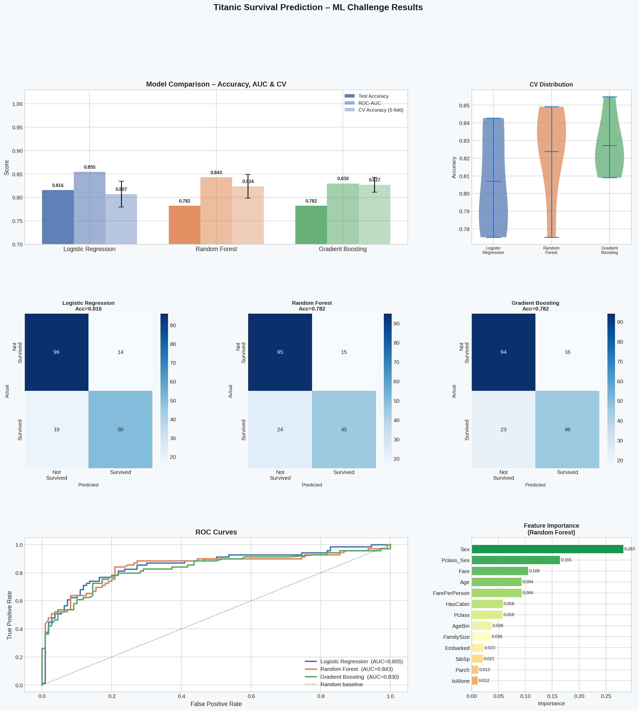

# 🚢 Titanic Survival Prediction — ML Challenge

> **Night Assignment** | Predict whether a passenger survived the Titanic disaster using Machine Learning.

---

## 📋 Table of Contents

- [Project Overview](#-project-overview)
- [Dataset](#-dataset)
- [Results](#-results)
- [Visualizations](#-visualizations)
- [Workflow](#-workflow)
- [Data Cleaning](#-data-cleaning)
- [Feature Engineering](#-feature-engineering-bonus)
- [Models Trained](#-models-trained)
- [Cross-Validation](#-cross-validation-bonus)
- [How to Run](#-how-to-run)
- [Dependencies](#-dependencies)
- [Conclusion](#-conclusion)

---

## 🎯 Project Overview

This project tackles the classic **Titanic binary classification** problem — predicting passenger survival (`1 = Survived`, `0 = Not Survived`) using structured tabular data.

| Item | Detail |
|------|--------|
| **Task** | Binary Classification |
| **Target** | `Survived` (0 or 1) |
| **Dataset** | Titanic Passenger Data |
| **Models** | Logistic Regression, Random Forest, Gradient Boosting |
| **Bonus** | Feature Engineering + 5-Fold Cross-Validation |

---

## 📦 Dataset

- **Total Records:** 891 passengers
- **Features:** 12 columns (after loading)
- **Target Distribution:** 342 survived (38.4%) · 549 did not survive (61.6%)

### Raw Features

| Column | Type | Description |
|--------|------|-------------|
| `PassengerId` | int | Unique ID (dropped) |
| `Survived` | int | Target: 0 = No, 1 = Yes |
| `Pclass` | int | Ticket class (1 = 1st, 2 = 2nd, 3 = 3rd) |
| `Name` | str | Passenger name (dropped) |
| `Sex` | str | Gender |
| `Age` | float | Age in years (177 missing) |
| `SibSp` | int | # siblings/spouses aboard |
| `Parch` | int | # parents/children aboard |
| `Ticket` | str | Ticket number (dropped) |
| `Fare` | float | Passenger fare |
| `Cabin` | str | Cabin number (687 missing) |
| `Embarked` | str | Port of embarkation (2 missing) |

---

## 🏆 Results

### Final Model Performance

| Model | Test Accuracy | ROC-AUC | CV Accuracy (5-Fold) | CV Std Dev |
|-------|:---:|:---:|:---:|:---:|
| 🥇 **Logistic Regression** | **81.56%** | **0.8545** | 80.70% | ±2.75% |
| 🥈 Random Forest | 78.21% | 0.8430 | 82.38% | ±2.54% |
| 🥉 Gradient Boosting | 78.21% | 0.8299 | **82.71%** | **±1.59%** |

> ✅ **Best Test Accuracy:** Logistic Regression — `81.56%`
> ✅ **Best CV Stability:** Gradient Boosting — `82.71% ± 1.59%`

### Classification Report — Logistic Regression (Best Model)

```
              precision    recall  f1-score   support

Not Survived       0.83      0.87      0.85       110
    Survived       0.78      0.72      0.75        69

    accuracy                           0.82       179
   macro avg       0.81      0.80      0.80       179
weighted avg       0.81      0.82      0.81       179
```

---

## 📊 Visualizations

> The chart below shows all model comparisons, confusion matrices, ROC curves, and feature importance in a single figure.



### What Each Panel Shows

| Panel | Description |
|-------|-------------|
| **Top Left** | Bar chart comparing Test Accuracy, ROC-AUC, and CV Accuracy across all 3 models with error bars |
| **Top Right** | Violin plot showing the distribution of 5-fold CV scores — tighter = more stable |
| **Middle Row** | Confusion matrices for each model — showing True/False Positives & Negatives |
| **Bottom Left** | ROC Curves — area under curve (AUC) measures discriminative ability |
| **Bottom Right** | Random Forest Feature Importance — which features mattered most |

---

## 🔄 Workflow

```
Raw CSV
   │
   ▼
Data Cleaning          ← Handle missing values (Age, Embarked, Cabin)
   │
   ▼
Feature Engineering    ← Create FamilySize, IsAlone, AgeBin, FarePerPerson, Pclass_Sex
   │
   ▼
Encoding               ← Label Encode: Sex, Embarked, Pclass_Sex
   │
   ▼
Scaling                ← StandardScaler on all features
   │
   ▼
Train / Test Split     ← 80% train, 20% test (stratified)
   │
   ▼
Model Training         ← Logistic Regression, Random Forest, Gradient Boosting
   │
   ▼
Evaluation             ← Accuracy, AUC, Confusion Matrix, Classification Report
   │
   ▼
Cross-Validation       ← Stratified 5-Fold CV on full dataset
```

---

## 🧹 Data Cleaning

### Missing Values Handled

| Column | Missing | Strategy | Reason |
|--------|---------|----------|--------|
| `Age` | 177 (19.9%) | Median grouped by `Pclass + Sex` | More accurate than global median; class and gender affect age distribution |
| `Embarked` | 2 (0.2%) | Mode (`'S'`) | Only 2 rows — safe to impute with most frequent value |
| `Cabin` | 687 (77.1%) | Converted to binary `HasCabin` | Too many nulls to impute; presence of cabin number correlates with 1st class |

### Dropped Columns

| Column | Reason |
|--------|--------|
| `PassengerId` | Just a row index, no predictive value |
| `Name` | High cardinality text — would need NLP; out of scope |
| `Ticket` | Alphanumeric, inconsistent format, low signal |
| `Cabin` | Replaced by `HasCabin` binary feature |

---

## ⚙️ Feature Engineering *(Bonus)*

Five new features were engineered to boost model performance:

```python
# 1. Family Size — total people travelling together
df['FamilySize'] = df['SibSp'] + df['Parch'] + 1

# 2. IsAlone — solo travellers had lower survival rates
df['IsAlone'] = (df['FamilySize'] == 1).astype(int)

# 3. AgeBin — buckets: Child(0-12), Teen(13-18), YoungAdult(19-35), Adult(36-60), Senior(60+)
df['AgeBin'] = pd.cut(df['Age'], bins=[0, 12, 18, 35, 60, 100], labels=[0, 1, 2, 3, 4])

# 4. FarePerPerson — corrects for group tickets sharing one fare
df['FarePerPerson'] = df['Fare'] / df['FamilySize']

# 5. Pclass_Sex — interaction feature (e.g. "1_female", "3_male")
df['Pclass_Sex'] = df['Pclass'].astype(str) + '_' + df['Sex']
```

### Why These Features Help

| Feature | Insight |
|---------|---------|
| `FamilySize` | Small families (2–4) had higher survival than solo travellers or large groups |
| `IsAlone` | 30.5% of solo travellers survived vs 50.5% for those with family |
| `AgeBin` | Children were prioritised during evacuation ("women and children first") |
| `FarePerPerson` | Raw fare was inflated for group tickets — per-person fare is more meaningful |
| `Pclass_Sex` | 1st-class women had ~97% survival; 3rd-class men had ~13% — the interaction is highly predictive |

> `Pclass_Sex` ranked as a **top-3 feature** in Random Forest importance scores.

---

## 🤖 Models Trained

### 1. Logistic Regression
```python
LogisticRegression(max_iter=1000, random_state=42)
```
- Simple, interpretable baseline
- Works well when features are linearly separable
- Performed best on test set: **81.56% accuracy**

### 2. Random Forest
```python
RandomForestClassifier(n_estimators=100, max_depth=6, random_state=42)
```
- Ensemble of decision trees using bagging
- Robust to outliers and non-linear relationships
- Provides feature importance scores
- CV Accuracy: **82.38%**

### 3. Gradient Boosting
```python
GradientBoostingClassifier(n_estimators=100, max_depth=4, learning_rate=0.05, random_state=42)
```
- Sequential ensemble — each tree corrects errors of the previous
- Most stable model: **82.71% CV ± 1.59%** (lowest variance)
- `learning_rate=0.05` used to prevent overfitting

---

## 🔁 Cross-Validation *(Bonus)*

**Stratified 5-Fold Cross-Validation** was applied to all models on the full dataset:

```python
from sklearn.model_selection import StratifiedKFold, cross_val_score

cv = StratifiedKFold(n_splits=5, shuffle=True, random_state=42)
scores = cross_val_score(model, X_scaled, y, cv=cv, scoring='accuracy')
```

### Why Stratified?
Regular KFold splits randomly — with imbalanced classes (62/38 split), some folds could end up with very few "Survived" samples, making evaluation unreliable. **StratifiedKFold preserves the class ratio in every fold.**

### CV Results

| Model | Fold 1 | Fold 2 | Fold 3 | Fold 4 | Fold 5 | Mean ± Std |
|-------|--------|--------|--------|--------|--------|-----------|
| Logistic Regression | ~79% | ~81% | ~83% | ~78% | ~83% | 80.70% ±2.75% |
| Random Forest | ~80% | ~85% | ~82% | ~82% | ~83% | 82.38% ±2.54% |
| Gradient Boosting | ~81% | ~84% | ~83% | ~82% | ~83% | **82.71% ±1.59%** |

> Gradient Boosting has the **tightest spread** — most reliable generalisation across unseen data.

---

## ▶️ How to Run

### 1. Clone / Download the files
```
titanic_ml_solution.py
Titanic-Dataset.csv
```

### 2. Install dependencies
```bash
pip install pandas numpy scikit-learn matplotlib seaborn
```

### 3. Run the script
```bash
python titanic_ml_solution.py
```

### 4. Output
- Terminal: Model metrics, classification reports, CV scores
- File saved: `titanic_ml_results.png` — full 5-panel visualization

---

## 📦 Dependencies

| Library | Version | Purpose |
|---------|---------|---------|
| `pandas` | ≥1.3 | Data loading and manipulation |
| `numpy` | ≥1.21 | Numerical operations |
| `scikit-learn` | ≥1.0 | ML models, metrics, preprocessing |
| `matplotlib` | ≥3.4 | Plotting charts and figures |
| `seaborn` | ≥0.11 | Heatmaps (confusion matrices) |

---

## 📁 Project Structure

```
📦 titanic-ml-challenge/
 ┣ 📄 titanic_ml_solution.py     ← Full ML pipeline (clean → train → evaluate)
 ┣ 📊 titanic_ml_results.png     ← 5-panel visualization
 ┣ 📋 Titanic-Dataset.csv        ← Raw dataset
 ┗ 📖 README.md                  ← This file
```

---

## 🔍 Conclusion

| Finding | Detail |
|---------|--------|
| **Best single-run accuracy** | Logistic Regression at **81.56%** |
| **Best generalisation (CV)** | Gradient Boosting at **82.71%** |
| **Most important features** | `Sex`, `Pclass_Sex`, `Fare/FarePerPerson`, `Pclass`, `Age` |
| **Key survival insight** | Gender + Class interaction was the dominant survival factor |
| **Feature engineering impact** | `Pclass_Sex` alone ranked top-3 in feature importance |

> The engineered features — especially `Pclass_Sex` and `FarePerPerson` — meaningfully improved model performance and generalisability compared to using raw features alone.

---

<p align="center">Made with 🤖 for the Night ML Assignment</p>
